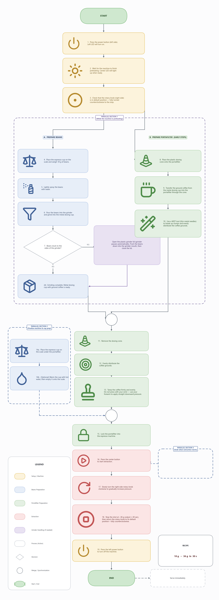

# ☕ Syntax of Coffee

Generate a **beautiful, modern infographic flowchart** of the espresso-making
workflow — soft colors, rounded cards, decision diamonds, BPMN-style parallel
sections, pictogram icons, a legend and a recipe chip — and export it as
**SVG** and **PNG**.

The diagram is hand-laid-out with **matplotlib** (full positional control) and
styled into an infographic. Icons come from the [Lucide](https://lucide.dev)
set and are recoloured per category and embedded automatically.



---

## 1. Library stack

| Concern | Library | Why |
| --- | --- | --- |
| Drawing + layout | **`matplotlib`** | Pixel-precise manual positioning of cards, diamonds, dashed "parallel section" containers, the legend and the recipe box. Native **SVG + PNG** export, no system binary required — ideal on Windows. |
| Icons | **Lucide** SVGs (downloaded + cached) | Clean, consistent, ISC/MIT-licensed line icons. Recoloured per theme on the fly. |
| SVG → PNG icon rasterizing | **`svglib` + `reportlab`** (default) or **`cairosvg`** (optional) | `svglib`/`reportlab` is pure-pip and works on Windows with no system libraries. The icon's alpha is reconstructed from its known stroke color, so icons are cleanly transparent. |

> **Why not Graphviz / the `diagrams` library?** Those do *automatic* layout,
> which fights a precise infographic design (two-column branches, dashed
> grouping boxes, a legend, a recipe chip placed exactly where you want it).
> matplotlib gives full manual control while still exporting clean vector SVG.
> Honourable mentions for this style: **Plotly** (shapes + annotations, also
> interactive) and **drawsvg** (direct low-level SVG).

---

## 2. Project structure

```
Syntax of Coffee/
├── main.py                     # CLI entry point: build + render
├── requirements.txt
├── README.md
├── src/
│   └── espresso_flow/
│       ├── __init__.py
│       ├── theme.py            # palette, fonts, sizes (per-category colors)  <- restyle here
│       ├── model.py            # dataclasses: Node, Group, Edge, Label, Diagram
│       ├── workflow.py         # the espresso content + positions             <- edit content here
│       ├── icons.py            # download, cache, recolour & rasterize icons
│       ├── canvas.py           # matplotlib drawing primitives (shapes/arrows/legend)
│       └── render.py           # figure setup + SVG/PNG export
├── examples/                   # a committed sample render (shown above)
├── assets/                     # generated icon cache (git-ignored)
│   ├── icons/                  #   raw + recoloured SVGs
│   └── icons_png/              #   rasterized transparent PNGs
└── output/                     # your generated diagrams (git-ignored)
    ├── espresso_flow.svg
    └── espresso_flow.png
```

The separation is deliberate: **`workflow.py` = content + positions**,
**`theme.py` = looks**, **`canvas.py` = how shapes are drawn**.

---

## 3. Install

```powershell
python -m venv .venv
.\.venv\Scripts\Activate.ps1        # PowerShell
python -m pip install -r requirements.txt
```

No system binary is needed. (Optional, alternative icon rasterizer — needs the
Cairo runtime on Windows: `python -m pip install cairosvg`.)

---

## 4. Run

```powershell
python main.py                 # SVG + PNG into ./output
python main.py --no-icons      # text-only cards, fully offline & fast
python main.py --formats svg   # one format only
python main.py --dpi 200       # higher-resolution PNG
python main.py --open          # open the PNG when finished (Windows)
```

First run downloads the icons (a few KB each) and caches them under `assets/`,
so later runs work offline. If an icon can't be fetched or rendered, that card
falls back to text — **the build never fails because of icons**.

---

## 5. Customizing

**Colors / theme** — edit `src/espresso_flow/theme.py`:
- `CATEGORIES` — the pastel `fill` / `edge` / `text` / `icon` color of each step
  family (`machine`, `beans`, `portafilter`, `extraction`, `grinder`,
  `process`, `startend`). These keys match the legend.
- `Theme.font`, `body_pt`, `title_pt`, `icon_frac` — typography and icon size.
- `Theme.corner`, `pill_corner_frac` — card / pill rounding.

**Icons** — set `icon=` on any `Node` in `workflow.py` to any name from
<https://lucide.dev/icons>. Prefer Phosphor or Font Awesome? Change the URL
templates in `icons.py` (`LUCIDE_SOURCES`) to that set's raw-SVG CDN — the
recolour/rasterize/cache pipeline is icon-set agnostic.

**Labels / steps** — `workflow.py` is the single source of truth. Each `Node`
has `text` (use `\n` for line breaks), a center `(x, y)`, `w`/`h`, a `kind`
(`card` / `decision` / `pill` / `circle`), a `category` and an `icon`. Add a
step by adding a `Node` and wiring it with `Edge(src, dst, ...)`.

**Layout / parallel sections** — the canvas is 0..110 wide with **y growing
downward**. Branches are arranged in columns (left ≈ x26, center ≈ x52/56,
right ≈ x85). A dashed `Group` draws a labelled "parallel section" container; a
`Group.arrow_to` adds a dashed pointer to a node. Synchronization points are
small `circle` nodes that both branches connect into.

**Connectors** — each `Edge` has a `route`: `v`/`h` (straight),
`vhv`/`hvh` (Z-shaped with a `midy`/`midx` bend) or `vh`/`hv` (single L-bend),
plus `style="dashed"`, an optional `label` (e.g. `YES`/`NO`), and explicit
`src_side`/`dst_side` (`top`/`bottom`/`left`/`right`).

---

## License

Code: MIT. Icons: [Lucide](https://github.com/lucide-icons/lucide) (ISC/MIT).
